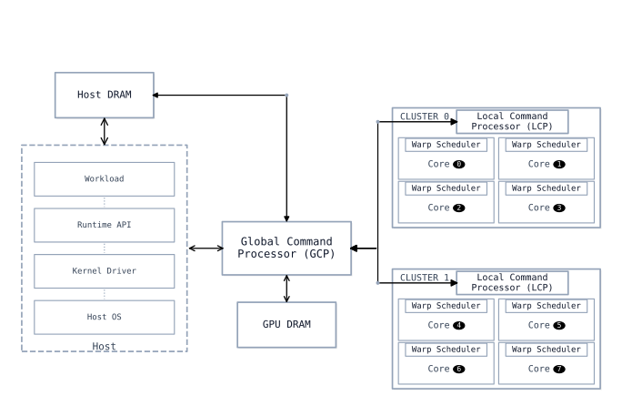
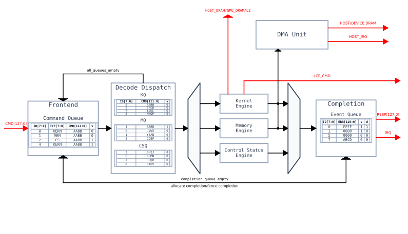
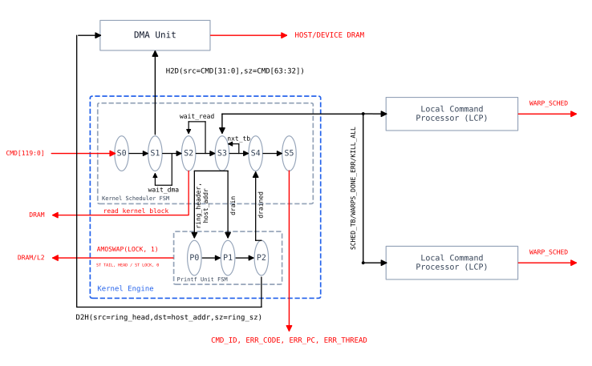
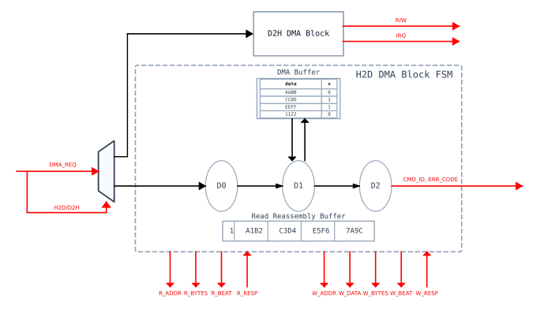
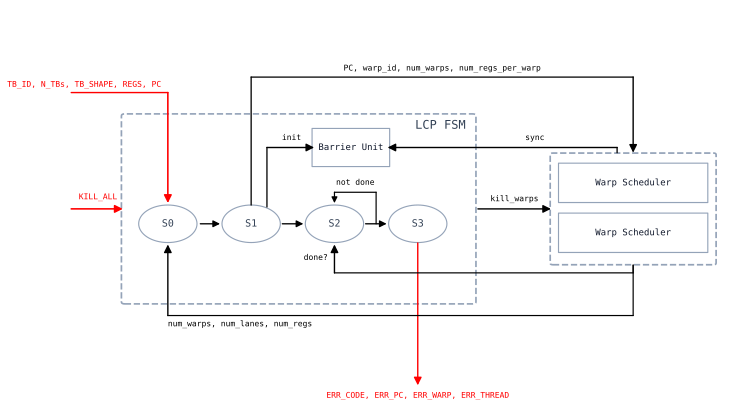

# Command Processor

## Overview

Hierarchical CP orchestrating compute, copies, perf, and completions.
- Single‑tenant: at most one kernel (grid) in flight.
- No GPU VA: device pointers are raw VRAM addresses.
- MMIO headers + DMA payloads; driver handles alloc/pin/map.
- Any warp fault ⇒ grid kill; completion carries error bit + culprit.
- Per‑kernel printf ring in VRAM; slices occasionally DMA’d back.
- No Neutrino: `__syncthreads` handled in LCP (single SM‑wide barrier).
- Runtime zeroing .bss; warps cooperate to zero section.

# Global Command Processor

## Overview

Top‑level ingestion, routing, and completion.
- Ingests fixed 16‑B headers (ready/valid); payloads live in memory.
- Internal queues: kernel, memory, cs, result tagged by command ID. Schedules out‑of‑order across them.
- Backends kernel engine, memory engine, control status engine: dequeue from head of command queue, mux by command type to forward to backend.
- `FENCE` drains all queues before accepting next header.

## IO

- Input MMIO: 16 bytes (1B opcode, 1B ID, 14B args), ready/valid
- Output MMIO: 16 bytes (1B ID, 15B err), ready/valid
- Output IRQ: 1 bit response interrupt
- Kernel Engine I/O, DMA Unit I/O see respective sections

## Functionality

- Frontend: Receive 16 byte header, enqueue to command queue, event queue (done set LOW). Dispatch of FENCE is blocked until all queues are emptied.
- Decode & Dispatch: Decode header type, enqueue to either KQ, MQ, CSQ.
- Engines: Backends that dequeue their corresponding type table, and execute the command.
- Completion: Event queues whose error and done bit are set by the engines on completion.

# Kernel Engine

## Overview

- Executes one kernel at a time.
- Schedules threadblocks to LCPs.
- Manages kernel specific printf ring.
- Catch erroring threadblock and issue kill all to SMs.
- Provide ERR to event queue

## IO
- Kernel Command: 15 bytes
- R/W to DRAM (mbus stats)
- LCP interface 
  - OUT: (valid (1 bit), TB_ID (6 bytes), N_TBs (4 bits), TB_SHAPE (6 bytes), REGS (1 byte), PC (4 bytes) + KILL_ALL(1 bit)) * N_LCP = 142 * N_LCP bits
  - IN: (valid (1 bit), ERR_CODE (1 byte), ERR_PC (4 bytes), ERR_THREAD (6 bytes)) * N_LCP = 89 * N_LCP bits 

## Functionality

### Kernel Scheduler
- S0: Get CMD, extract base addr and size of kernel header in host memory.
- S1: Trigger H2D DMA from `host_addr` of size `sz` to `gpu_addr`.
- S2: Read DMAed block from `gpu_addr` of only header size and extract kernel params: `grid_dims`, `block_dims` `kernel_addr`, `sz`, `params`, `printf_header`, etc.
- S3: 
  1. Init printf unit with ring header info. 
  2. Zero `tb_ctr`. Calculate `total_threadblocks = grid.x * grid.y * grid.z`, `regs_per_tb = regs_per_thread * LANE_WIDTH * blockdims.x * blockdims.y * blockdims.z`, `min_tb_per_cluster = ceil(total_threadblocks/clusters)` 
  3. For each LCP, calculate number of threadblocks to schedule now based on `min(total_threadblocks - tb_ctr, min_tb_per_cluster, floor(regs/regs_per_tb), floor(shmem/shmem_per_tb), floor(block.x * block.y * block.z/(cores * warps_per_core * threads_per_warp)))`. Record `TB_ID` and `N_TBs` for each LCP. Dispatch threadblocks to the LCP, increment `tb_ctr`. 
  4. If `tb_ctr < tot_tbs`, dispatch more threadblocks when an LCP signals completion, otherwise record `ERR_OK`. If any LCP signals `ERR`, record `ERR_CODE, ERR_PC, ERR_THREAD`,  issue `KILL_ALL` to all LCPS. Occasionally drain printf ring (pick policy).
- S4: Drain printf ring, wait for drain.
- S5: Forward error to event queue.

### Printf Unit
- P0: Get ring header addr, host_addr.
- P1: If drain signal, acquire ring lock: AMOSWAP lock bit, read ring header.
- P2: Issue D2H DMA of printf ring, move printf ring tail back to head, release lock bit.

# DMA Unit

## Overview
- Handle copy and set commands
- Bidirectional: Two unidirectional DMA blocks H2D and D2H. Identical except that D2H also has to drive IRQ.
- Two buffers per block: DMA buffer to cache DMA reads before writing them out, and read reassembly buffer to reassemble a multi-beat memory request.

## IO
- IN: DMA_REQ (15 bytes), 2x(R_RESP (mbus), W_RESP (1 byte))
- OUT: 2x(R/W_ADDR (4+4 bytes), R/W_BYTES(4+4 bytes), R/W_BEAT(2*log(max_beats) bytes), W_DATA (mbus)) + IRQ (1 bit)

## DMA Block functionality
- Three states, D0, D1, D2.
- D0: upon req reception, init state, set base addr, zero out read ctr and write ctr, zero head and tail into DMA buffer, transition -> D1.
- D1: read data into read reassembly buffer, enqueue into DMA buffer, write data out of DMA buffer
  - If read reassembly buffer is empty, issue a read memory request for base_addr + read_ctr, increment read_ctr by req sz upon fire
  - For each beat response, enqueue data into read reassembly buffer. When read reassembly buffer is full one of two following is possible:
    - If head == tail and DMA write is ready, short circuit dma buffer and issue write, increment write_ctr.
    - Otherwise, enqueue to DMA buffer
  - If write ready and head != tail, issue write to base_addr + write_ctr, increment write_ctr
  - When write_ctr == req_sz, transition -> D2
- D2: issue response, back to D0

# Local Command Processor

## Overview

- Creates and schedules warps from obtained TBs
- Handle TB level barrier synchronization
- Kill all warps on error, and report error upstream

## IO

- IN: valid (1 bit), TB_ID (6 bytes), N_TBs (4 bits), TB_SHAPE (6 bytes), REGS (1 byte), PC (4 bytes) + KILL_ALL(1 bit) = 142 bits
- OUT: valid (1 bit), ERR_CODE (1 byte), ERR_PC (4 bytes), ERR_THREAD (6 bytes) = 89 bits

## Functionality

- S0: Obtain TB_ID, N_TBs, TB_SHAPE, REGS (regs per thread), and PC
- S1: 
  - Calculate `warps_per_tb =  TB_SHAPE / LANE_WIDTH`, `total_warps = N_TBs * warps_per_tb`
  - Calculate `warps_per_core = ceil(total_warps / num_cores)`
  <!-- - Calculate `warps_per_core: min(floor(REGS_PER_CORE / (REGS * LANE_WIDTH)), warp_slots_per_core, minimum_warps_per_core)` -->
  - If any of the above numbers are zero, do not scheduler warp and immediately report error upstream.
  - For each warp scheduler i, drive tb_id=i*warps_per_core/warps_per_tb, num_warps=warps_per_core, PC, thread_offset=TB_ID * block_dims + i * warps_per_core * LANE_WIDTH (thread_offset to set thread id csr)
  - Initialize barrier unit with N_TBs, warps_per_tb
- S2: Wait for warps to complete. If any warp return error, save and drive "kill_all_warps"
- S3: Return ERR

## Barrier Unit
- Maintain per threadblock counter
- Upon arrival of a barrier, either zero the corresponding counter and set it to valid, or increment it
- When all warps have arrived, drive tb_id and release

# Command Model

Constant command length. All extras are DMAed from memory.

Command retrieved in one cycle. 16 byte command, 1 byte command id, 1 byte command header, 14 bytes variable.

## Packet Types

- `CMD_ID, LAUNCH_KERNEL { host_addr, sz, gpu_addr }` : head sz = 1 byte + 1 byte + 4 bytes + 4 bytes + 4 bytes = 14 bytes.
    - `{entry_pc, grid_xyz, block_xyz, regs_per_thread, shmem_per_block, flags, printf_host_addr, binary_sz, params_sz, binary, params, printf_ring_header, printf_ring}` : memory layout at addr, with size sz. If sz doesn’t match the last param, then it’s your fault:
        
        params contains printf_ring_header’s base address, and this needs to be passed as a parameter to the function.
        4 bytes + 3*2 (6) bytes + 3*2 (6) bytes + 1 byte + 4 bytes + 1 byte + 4 bytes + 4 bytes + 4 bytes = 34 bytes + variable.
        
    - flags = dynamic_warp_occupany=0/1, others?
- `CMD_ID, COPY { src, dst, len, flags }` : header sz = 1 byte + 1 byte + 4 bytes + 4 bytes + 4 bytes + 1 byte = 15 bytes
    - flags = dir (H2D, D2H), others? 7 more bits available
- `CMD_ID, MEMSET { dst, value, len }` : header sz = 1 byte + 1 byte + 4 bytes + 4 bytes + 4 bytes = 14 bytes
- `CMD_ID, READ_COUNTER { id, flags }` : header sz = 1 byte + 1 byte, 14 bytes id + flags
- `CMD_ID, FENCE { flags }` : header sz = 1 byte + 1 byte, 14 bytes for flags

## Ordering Rules

- Headers issue in order, but execute out of order, and complete in order.
- `FENCE`: drains all queues before subsequent ingestion.
    - The system behaves as a single CUDA stream with coarse synchronization support.

## Response Format (v1)

- `{ CMD_ID, ERR_CODE, ERR_PC, ERR_THREAD}` = 1 byte + 1 byte + 4 bytes + 4 bytes = 10 bytes

# Printf Ring

`bool lock, uint32_t head, uint32_t tail, uint32_t limit_offset` = 129 bits
Grab lock, if tail + bytes > limit_offset, cannot write and wait for drain. If not, write to tail, increment tail by bytes written.

# Software

## Usermode runtime
- API for malloc, memcpy, memset, launch_kernel, read/set csrs
- ioctl to kernel driver

## Kernel Driver
- Kernel mode linux driver/baremetal runtime
- Turn ioctls to command stream handling
- Manage free memory list, alloc memory
- Assign context to cmd, create cmd lists, handle stream dependencies
- Get phys address of usermode process, encode phys addr into CP cmd
- Dispatch cmds to CP, insert FENCES
- Handle response, parse errors, free contexts
- Pipe printf ring DMAs to stdout

# Future Work

- GPU virtual memory + multi‑tenant execution
- Replace CP with rocket chip
- Better CUDA stream and dependency support, async memcpy/malloc, DMA scoreboard to interleave mem ops with kernel launch ops
- Better debugging and profiling support

