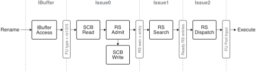
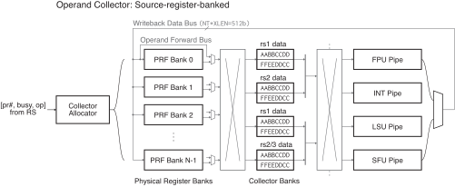
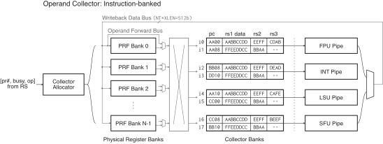
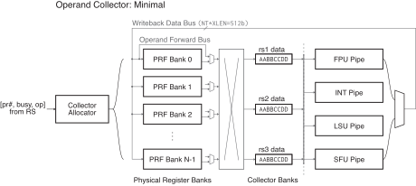

Issue Logic
===========

## Contents

* **Scoreboard**: [link](#scoreboard)
* **Reservation Station**: [link](#reservation-station)
* **Operand collector**: [link](#operand-collector)

## Module Interface

Inputs: TODO
Outputs: TODO

## Overview


Central scoreboard and distributed reservation stations working in conjunction. (TODO)

The issue stage design captures the following key performance opportunities:

* **Past-head-of-line intra-warp ILP.**
* **Bank conflict smoothing.**

Detailed pipeline timing for the issue stage:

<p align="center">
  
</p>

* **SCB Read / Write**: The [scoreboard](#scoreboard) is a flop-based memory with asynchronous
  read / synchronous write.  It is important for the read and write stages to
  be in the same cycle, so that the RS Admit stage does not miss the
  newly-written values.
* **RS Admit** determines whether to admit the instruction at the IBUF head to
  the [reservation station](#reservation-station) by conducting a [hazard
  check](#hazard-check) logic. It also asserts dequeue signals to the per-warp
  IBUF upon successful admission.
* **RS Search** conducts a CAM scan through every entry in the RS to generate
  a bit vector that indicates all issue-eligible entries.
* **RS Dispatch** receives the eligibility vector and arbitrates a single
  instruction to dispatch to the EX pipeline, using an appropriate
  warp-scheduling policy.

**TODO**: Add collector pipe stages, IBUF dequeue timing, sync-read SCB.


## Scoreboard

The main role of the scoreboard is to **bookkeep pending writes and reads to
registers from in-flight instructions**.  Bookkeeping pending register writes
and reads are crucial to (1) correctly handle WAR/WAW hazards, and also to (2)
determine whether to read operand from the PRF or forward from EX for RAW
hazards.

The scoreboard is largely left as the bookkeeping states themselves, and the
combinational logic that handles hazard checks is split to a separate module.

### Hazard check

The main role of the hazard check module is to:

* **Gate admission of an IBUF entry to the reservation station.**
* **Correctly populate `busy` bit of the RS entry.**

#### RAW hazard

RAW hazards are handled by operand forwarding.  Upon RS admission, the
scoreboard's `pendingWrite` is queried for rs1/rs2/rs3 of the instruction. If
the bit is set, a new entry is created in the RS with the `busy` bit set. This
indicates that the operand should be broadcasted from the EX stage via
forwarding path, instead of being read from the PRF via the operand collector.

```
Set pendingWrite[R] when:
    admitting to RS an instruction writing to R
Clear pendingWrite[R] when:
    instruction writing to `R` completes writeback
```

#### WAR hazard

Since we don't eliminate WAR/WAW hazards via full register renaming, WAR
hazards are simply resolved by stalls.

Let's look at an example:

```
i0: lw     <- 0(r5)
i1: add r5 <-        # write-after-read
```

Since the RS allows out-of-order issue, `i1` may issue and complete earlier
than `i0`, e.g. when LSU is busy.  This risks the result of `add` clobbering
the older read of `r5` at `i0`.

##### Option 1: Gate RS admission of younger writes

The simplest option to solve WAR is to prevent admission of any
younger writers (`i1` to `r5`) if there exists any older reads in the RS (`i0`).
This requires the scoreboard to keep track of a `pendingReads` signal per register,
incrementing it when admitting an instruction that reads the register to the
RS, and decrementing when its PRF read is complete.
Importantly, `pendingReads` must be incremented only for regs that are
actually read from the PRF, and **not forwarded from the fabric**.  Otherwise,
if the reg operand is forwarded from EX, we don't need to protect them as their
values will not be clobbered by an out-of-order WB.

In summary, the logic for `pendingReads` becomes:

```
Increment pendingReads[inst.rs] when:
    (admitting to RS an instruction reading inst.rs)
    AND (pendingWrite[inst.rs] == 0, i.e. inst.rs will be read from PRF)
Decrement pendingReads[inst.rs] when:
    (inst.rs completes operand collection from PRF)
```

In case where we cannot increment `pendingReads[R]` because the counter bits
are saturated, we simply gate admission to the RS and stall that warp until the
counter falls back down.

With all of this in place, we now gate admission to RS if `pendingReads[rd]` is set:

```
admitRS[inst] iff:
    pendingReads[inst.rd] == 0
```

While simple, this solution likely overly constricts the instruction window, as
false hazards are frequent.

##### Option 2: Stall WB of younger writes

A second option is to use the same `pendingReads` counter, but **stall the
writeback of the younger write until `pendingReads` clear**.  Going back to the
above example, instead of gating admission of `i1` to the RS, we stall
writeback of `i1` until `pendingReads[r5]` reaches 0.  This ensures `i0` reads
the correct old value from PRF without getting clobbered by the younger `i1`.
In other words:

```
admitWriteback[inst] iff:
    pendingReads[inst.rd] == 0
```

###### Potential deadlock problem in Option 2

By stalling WB instead of gating RS (Option 2), there is now a possible
deadlock condition when we admit newer reads after the WAR. Consider this:

```
i0: lw     <- 0(r5)
i1: add r5 <-        # WAR to i0
i2: sub    <- r5     # RAW to i1
```

The problem is that even though the admission to RS is in-order, the **operand
read and writeback can happen out-of-order**.  Consider this series of events:

* `i0` reader enters RS, bumping `pendingRead++ -> 1`.
* `i1` writer enters RS, bumps `pendingWrite++ -> 1`, and issues to EX.
* `i2` reader enters RS, bumps `pendingRead++ -> 2`. Because of the RAW, it
  cannot read its value from the PRF until `i1` finishes and sets `pendignWrite -> 0`.
* `i1` EX finishes, but it must stall WB until `pendingRead` falls back to `0`.
  Now there is a circular dependency between `i1 WB -> i2 read -> i1 WB`,
  causing a deadlock.

This deadlock can be resolved in one of two different options:

###### Option 2-1: Must-forward invariant

If we guarantee all RAWs within the instruction window to be forwarded
instead of reading from the PRF, then we can skip incrementing `pendingRead`
for the forwarded reads, which prevents the deadlock issue.

In the below example, `i2` will see `pendingWrite[r5] = 1` set by `i1`, which
will cause the hazard logic to admit `i2` to the RS with the `busy` bit set.
Whenever the `busy` is set, we skip incrementing `pendingRead` upon RS admission:

```
i0: lw     <- 0(r5) # pendRead -> 1
i1: add r5 <-       # WB stalled until pendRead -> 0; pendWrite -> 1
i2: sub    <- r5    # admitted immediately; pendRead **not incremented** due to forwarding
                    # issue stalled until pendWrite -> 0
```

For this to work, we need a strong guarantee that whenever `busy == 1`,
**forwarding always succeeds**.  That is, if multiple EX operations finish
within one cycle, all of the ops must successfully forward, instead of dropping
any of the values (which will cause the RAW to fall back to regular PRF write
-> re-read path).  This may necessitate having a **writeback buffer** to smooth
out the back-pressure (TODO: explore).


###### Option 2-2: Opportunistic forwarding with epoched pendingReads

Another option is to not rely on the must-forward invariant and allow
RAW reads to read from PRF, but make `pendingRead` counters **epoched**
so that you can distinguish before and after the writes and break the circular
dependency.

Now, each register has two counters `pendingRead[0]` and `pendingRead[1]`,
which will be indexed by `epoch={0,1}`.

If we allow some of the forwarded values to be dropped, now we need to ensure
the younger reads past a write does not read the old value in the PRF before
the write, i.e. `i2` does not read `r5` before `i1` writes to it.

```
--------- RS ---------
i0: lw     <- 0(r5) # pendRead[epoch=0]: 0->1
i1: add r5 <-       # WB stalled until pendRead[epoch=0] -> 0; **flip epoch->1**, bump pendWrite: 0->1
i2: sub    <- r5    # pendRead[epoch=1]: 0->1; issue stalled until pendWrite -> 0
```

Now, `i1` needs to stall WB until `pendRead[epoch=0]` goes to 0, which is
independent from `i2`'s `pendRead[epoch=1]` changes, breaking the dependency.

Note that we only need 2 epochs because we only admit a single write to the RS
window for every register.


#### WAW hazard

Similar to WAR, WAW hazards are also resolved by stalls.  Specifically, we gate
admission of an instruction to the RS if the instruction's destination register
already has a pending write.  This way, we guarantee that there is only one
write to every register within the RS issue window, without aliasing younger
reads to a different write:

```
i0: add r5 <-   
i1: sub    <- r5
i2: add r5 <-     # XXX blocked admission; otherwise younger reads (i3)
                  # cannot be distinguished from older reads (i1)
i3: mul    <- r5
```

The final RS admission logic becomes:

```
admitRS[inst] iff:
    pendingWrites[inst.rd] == 0
```

##### Optimization: Allow past-WAW admission to RS

Gating RS admission on a WAW gives up opportunity of discovering ILP
on younger instructions that are completely independent.  For example:

```
i0: add r5 <-   
i1: sub    <- r5
i2: add r5 <-     # XXX blocked admission
i3: lw     <- r4
```

`i3` does not consume or produce `r5`, and is safe to enter the RS.  However,
gating `i2` causes head-of-line blocking at the instruction buffer, since
IBUF-to-RS admission is done strictly in program-order at the head end of IBUF.

A fence-based scheme is possible to avoid this: Add a per-reg `Fence` bit to
the scoreboard, and set it upon seeing WAW at IBUF head.
Then, **look past the head of IBUF**, and **only** gate RS admission if the
instruction's rs or rd has `Fence` set.
`Fence` is cleared when the older write completes writeback.

```
admitRS[inst] iff:
    (Fence[rs] == 0 for all rs in inst.rs0/1/2) AND
    (Fence[inst.rd] == 0 AND pendingWrites[inst.rd])
```

This scheme increases hardware complexity, since now the hazard logic needs to
sequentially walk IBUF entries past the FIFO head. This is best to be left for
future optimization.


### Hardware requirements

Memory capacity requirement of the scoreboard using a per-reg bit vector
design:

(`PREG=256` registers) * (1 pendingWrite bit/reg + 2 pendingReads bit/reg) = **768 bits (96 bytes)**.

## Reservation Station

Key features of Muon's reservation station are:

* **Intra-warp OoO issue**.  Unlike a scoreboard design, the RS looks past a
  blocked head and issues a later independent instruction *inside a single
  warp.* This allows making progress past a long-stalling memory op and
  uncovering some amount of intra-warp ILP.
* **Unified handling of operand forwarding and collection**.  The RS stores the
  data bits for each register operand, not only the busy bits.  This allows the
  RS to book PRF read request from the operand collector, while at the same
  time receiving forwarded data from the EX stage.

A major difference with RS designs in CPU OoO is:

* **No WAR/WAW avoidance via register renaming**.  In OoO CPUs, WAW hazards are
  avoided by allocating new physical registers to multi-writer instructions to
  the same architectural destination register.  Since physical register budget
  is tight for GPUs, we resolve WAW simply by stalling issue until previous
  writes are complete. This choice is backed up by three reasons:
  * Kernel writers frequently unroll loops to amortize branching costs and
    increase ILP.  This eliminates a major source for WAW hazards for GPUs.
  * Without WAW renaming, the sole purpose for renaming becomes compacting
    per-warp arch regs to contiguous physical reg space.  This vastly
    simplifies the renaming hardware since no freeing of phys regs happen
    during the kernel runtime, and the renaming logic boils down to simple
    linear allocation.
  WAR hazard is a non-issue since we don't support precise exceptions.

### Splitting metadata/data fields across RS/collector

The reservation station stores instruction metadata fields (e.g. op type,
physical register #, valid/busy bits) separately from the operand data fields.
This is because the metadata requires high-throughput CAM access for wake-up
broadcast on writeback and operand collector allocation.  As such, the metadata
fields are best stored in fast flip-flops.

On the other hand, the operand data fields have modest memory access
requirements: Single-row access per cycle for operand read and write-back. They
also have high capacity demand due to their wide bit widths (`NT*XLEN`). SRAM
arrays serve as the best storage of choice.

* **TODO**: Store age for load/store instructions
  * Necessary for LSU to determine program order of load/stores within a thread
  * Capped by in-flight memory ops, i.e. LSU queue depth


### Hardware requirements

#### Memory requirements

It is necessary to store the metadata fields used for writeback broadcasting
separately from the data fields used at the dispatch time, since the two have
different access characteristics.

* Each RS entry: 1625 bits
  * Metadata fields: 1b valid + (8b preg# + 1b valid + 1b busy) * 3 operands = 31 bits
    * Access: CAM for clearing busy bit on writeback
  * Data fields: (3b warp + 32b PC + 7b opcode + 16b tmask + (16*32b data) * 3 operands = 1594 bits
    * Access: 1R 1W
      * 1R: Read 1 entry selected by dispatch scheduler, dispatch it to FU.
        * **May need >1R** if RS is per-FU-class, serving multiple FU pipes.
      * 1W: Choose 1 entry out of the ones that matched writeback broadcast in
        the metadata table, and forward data to it
* 16-entry RS (2 per warp): 496b metadata table, 25504b data table

#### Wiring requirements

Forwarding fabric may be expensive, since operand bits are wide
(`VLEN*WORDSIZE`=64 bytes) and it must be broadcasted to *all* RS entries.


## Operand Collector

Operand collector consists of the following components:

* **Physical register file banks.**  PRF is banked by the register number.
  We use a simple, static round-robin banking scheme of `Bank[reg] = reg mod n_banks`.
* **Collector banks** stage the operand data that are read so far, either from
  the PRF or from the forwarding fabric.
  Collectors are banked by the FU pipe so that the connectivity to FUs is
  direct and low-cost. Each collector row contains all operand fields,
  PC/rs1/rs2/rs3, which makes single-cycle issue straightforward.
* **Collector allocator** serves two purposes:
  * **Arbitrates PRF banks** to choose conflict-free bank accesses.  This
    requires reading *all* entry's preg# fields from the RS and finding a
    combination that maps to as many different banks as possible.
  * **Allocates a collector entry** for each RS entry.  This happens when (1)
    a new entry is admitted to the RS, and (2) there exist available space in
    the collector bank that matches the instruction's FU type.
    The (2) condition may not always hold when e.g. instruction mix is skewed
    and a single FU-type collector bank runs out of space.

TODO: elaborate why a simple duplicate-bank regfile design requires collector
logic.

### IO

The collector provides an latency-insensitive interface for operand read/writes
so that the RS can make issue-scheduling decisions in a timing-decoupled way.

* `readReq`: Requests the collector to initiate an operand read and expose it
to the `readData` port.
* `readResp`: Indicates the requested operand will be available at the
collector bank port (`readData`) *at the next cycle*.  RS uses this to
arbitrate among eligible, all-collected instructions and expose it to the issue
port at the next cycle, lining up with the collector data.
* `writeReq`/`writeResp`: Same as `readReq`/`readResp` but for writes.  Normally
the response has a 1-cycle latency because writes don't cause bank conflicts.
* `readData`: Port that serves the operand data to EX.  Its member `req` tells
to the collector which bank entry to be read, and `resp` exposes the full
register vector-data stored at that entry to the port. `resp` is
combinational-read.

See [Collector.scala](/src/main/scala/radiance/muon/Collector.scala) for the
implementation.

### Collector banking strategies

#### Source-register-banked collectors



* **Pros**:
  * **Less area overhead in banking**: Each bank has the width of 512b (`NT *
    XLEN`), which is shorter than instruction-banked (3*512b).
  * **Allows within-instruction coalescing**:  Rs1/rs2/rs3 of a single instruction
    can be fetched in the same cycle as they arrive at different banks.
* **Cons**:
  * **Necessitates another crossbar before the FUs**, because the rs1/rs2/rs3
    of a single operation is scattered across different collector banks.
    The Xbar cost can be managed by merging some FU ports together (e.g. FPU
    with seldomly-used SFU.)

##### Hardware cost

* PRF banks: `4 banks * 64-deep * 512b = 131072b = 16KiB`, `39.7k um^2`
  * 1 bank: 2 * 64-deep, 256-wide uhd 2-port RF: `2 * 4966.073 um^2 = 9932.146 um^2`
  * 4 banks
* Collector banks: `4 banks * 8-deep * 512b = 16384b`, `27.5k um^2`
  * 8-deep, 256-wide uhd 2-port RF: `3446.816 um^2`
  * 4 banks
* Sum: `67.2k um^2`, collector/PRF overhead: `69%`


#### Instruction-banked collectors



* **Pros**:
  * **Cheaper wiring to FUs without 2nd crossbar**: All of rs1/rs2/rs3 are
    guaranteed to be stored within a single bank, and that allows direct
    connection to a single FU pipe.
    * However, this comes with the potential cost of **underutilizing per-FU collectors**
      if the instruction mix is skewed.
* **Cons**:
  * **Higher area overhead in banking**: Each bank is very wide (3*512b), and
    requires multiple wide-and-shallow SRAMs.  Also, since the minimum depth
    supported by SRAM macros is 8, it fixes the minimum entries we can provision
    to 8 * banks (32 at four banks).
  * **Disallows conflict avoidance within an instruction**: Rs1/rs2/rs3 of the
    same instruction are stored to the same bank and needs to be serially
    written.  Therefore each instruction experiences (# of RS) cycles at
    minimum.  This doesn't necessarily bottleneck IPC, because full-throughput
    accesses can still be found across instructions.

##### Hardware cost

* PRF banks: `4 banks * 64-deep * 512b = 131072b = 16KiB`, `39.7k um^2`
  * 1 bank: 2 * 64-deep, 256-wide uhd 2-port RF: `2 * 4966.073 um^2 = 9932.146 um^2`
  * 4 banks
* Collector banks: `4 banks * 3 RS * 8-deep * 512b = 49152b`, `310k um^2`
  * 1 bank: 3 * 8-deep, 256-wide uhd 2-port RF: `3 * 3446.816 = 10340 um^2`
    * **Note**: Minimal SRAM depth is 8, which causes overprovisioning;
      flip-flops may work better for fewer entries
  * 4 banks
* Sum: `350k um^2`, collector/PRF overhead: `780%`


#### Minimally-banked collectors



Instead of relying on cross-collector coalescing, increase # of PRF banks (`N`)
from 4 to 8 to reduce conflicts.

This is the design that Vortex takes as of its current version.

* **Pros**:
  * **Cheaper area**: Implementing the three entries in flip-flops may be
    cheaper than using awkward-shaped SRAMs.
  * **No 2nd crossbar** since single-entry rs1/rs2/rs3 are simply concatenated
    and broadcasted to the FU pipes.
* **Cons**:
  * **Serialization at every instruction** unless the rs1/rs2/rs3 of the
    instruction is completely conflict-free.
  * **No multi-FU dispatch**: Since dispatch is serialized at the single-entry
    collector, this design disallows dispatching instructions to multiple FUs
    at the same cycle.  This may not be a problem since fetch/decode throughput
    is 1 IPC.

##### Hardware cost

* PRF banks: `8 banks * 32-deep * 512b = 131072b = 16KiB`, `65.6k um^2`
  * 1 bank: 2 * 32-deep, 256-wide uhd 2-port RF: `2 * 4097.926 um^2 = 8195.852 um^2`
  * **8 banks** instead of 4 to take more advantage of bank-level parallelism.
* Collector banks: `512b*3 = 1536b`; *ChatGPT estimates `9~12k um^2` in flip flops*
  * 1-entry is too shallow for SRAM, need to be flip-flops
* Sum: ~`78k um^2`, collector/PRF overhead: `18%`


### Caching collectors


This design enhances the collector banks to re-serve register operands that are
re-used in subsequent instructions, in order to reduce bandwidth demand on the
PRF.

See
[patent](https://patentimages.storage.googleapis.com/a8/70/94/16936cf6b77e43/US8639882.pdf)
for reference.

* **Pros**:
  * **Reduced PRF pressure and bank conflicts**, since operand accesses that
    *hit* the collectors don't need to be redundantly read from the PRF again.
  * **Better BW and capacity utilization from data re-use**.
* **Cons**:
  * **Complex control logic for cache coherency**.  When a new value is written
    back to the PRF, the collectors must be scanned and be invalidated of its
    dirty values.  Or, they must act as a write-through cache, where the WB path
    writes to both the collectors and the PRFs.  In either case, this
    essentially boils down to implementing a hardware-managed cache.
  * **May still incur collector bank conflict**, if the cache-hit operand
    resides in the same bank as the other register operand of the instruction.
    In this case, the hit-operand must be duplicated into a different collector
    bank.
    * This can be worked around by allowing each collector bank to separately
      cache operands that come in one of the rs1/rs2/rs3 positions of the
      instruction.

### Operand Forwarding

Upon writeback, the result data may be forwarded to the collector banks
directly without experiencing latency of PRF write -> PRF read re-arbitration
into collectors.

The forwarded data is pulled from the WB fabric, which is bank-local at the
write port, and bypassed to the PRF read port, where a 2:1 MUX selects **WB
data** vs. **PRF read data**.  The WB data is **prioritized** to allow fast
forwarding and reduce RAW hazard stalls.

When the forwarded WB data wins over PRF read data at the bank egress, this
should also be notified to the **collector allocator**, so that it knows the
lost read needs to be re-scheduled.  Therefore, the WB bus needs some
connectivity to the allocator as well.

#### Wiring cost

Since the forwarding bus is pulled from the bank-local WB bus,
there is no extra broadcasting fabric to all collector banks, and the
bank-collector crossbar is reused with low overhead.  This design lowers wiring
cost compared to an alternative where the WB bus is broadcasted to every
collector bank with the 2:1 MUX selector positioned at the collector ingress.

### Crossbar cost

The designs need to be cognizant of wiring cost of the **crossbar** that
couples PRF bank output ports to collector input ports: For a `B=8` banks and
`C=4` collectors, the cost scales with `B*C*(NT*XLEN) = 8*4*(16*32b)`.

### Decoupling collector capacity vs RS

The collector entries don't need to exactly match the number of RS entries.
We only need enough entries that can uncover enough PRF bank-parallelism and
sustain high IPC, which will prevent build-up in the collector.
Let's use an analytical model to find how many entries will suffice for this
condition.

#### Analytical model

If we assume that the collector banks can collectively store `C` instructions,
each with 3 operands, than the probability of finding triplets out of `3C`
operands that land in the 3 different banks among `N` PRF banks are:

```
P(≥3 distinct banks among 3C draws)
= 1 − P(use ≤2 banks)
= 1 − [ C(N,1)·1^(3C) + C(N,2)·(2^(3C) − 2 ) ] / N^(3C)
= 1 − [ N + (N·(N−1)/2)·(2^(3C) − 2) ] / N^(3C)
```

Some values of `P` are:
```
N=4, C=1: 37.5%
N=4, C=2: 90.8%
N=4, C=3: 98.8%
N=4, C=4: 99.9%
N=8, C=1: 65.6%
N=8, C=2: 99.3%
N=8, C=3: 100.0%
N=8, C=4: 100.0%
```
