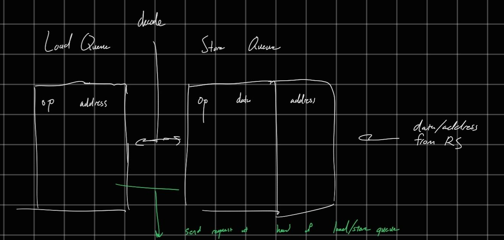
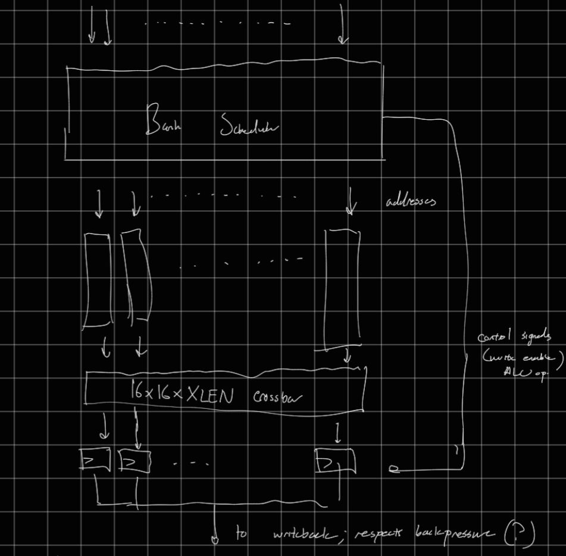
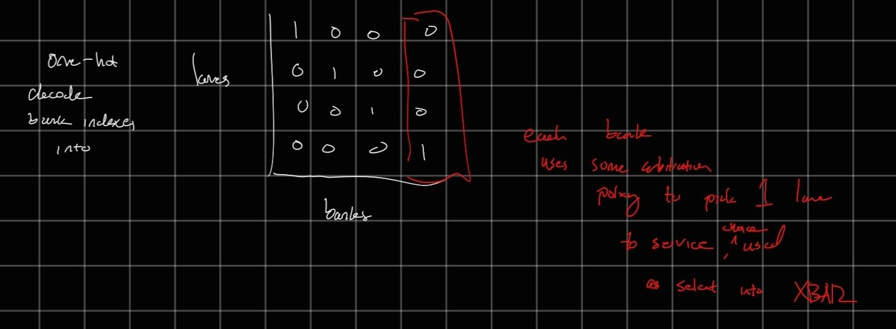

## General Notes
- Memory system will not support unaligned accesses (N-byte loads must be to addresses divisible by N)
	- CUDA has same limitation
- Memory ordering will be very relaxed - loads and stores in one thread can appear in any order to another thread
- Coherence is also relaxed
- see Coherency / Consistency section
- ISA modification: we introduce address space qualifier for loads and stores to distinguish global from shared memory; this requires some compiler changes but LLVM certainly supports it (worst case, use intrinsics for shared memory)
## Load / Store Queue
- other designs in handwritten PDF
### Design 2.5: Keep stores in program order, allow reordering consecutive loads
   
   - Slots in LDQ/STQ are allocated in program order from decode stage
   - LDQ entries contain the tail pointer of STQ from when they were allocated, and vise-versa
   - Loads not allowed to begin until head of STQ reaches the stored pointer (i.e. all older stores retired)
	   - Loads not only issued from head of queue (allows reordering consecutive loads)
   - Stores not allowed to begin until head of LDQ reaches stored pointer, and it is at the head of STQ (all older loads and stores retired)
   - Design forces program order, allows sizing the two queues differently
   - Separate load/store queues for shared memory accesses and global mem accesses. 
   - Maintain 1 LDQ/STQ per warp to prevent false ordering between warps - lower utilization, but should be ok
   - Load/Store queues statically map into large address SRAMs, read/write port shared across warps and global/shared queues. 
	   - Limits to issuing 1 memory xaction per cycle, should be ok
   - Store queues can also have a single big data SRAM
   - Load queue data - two options: 
	   1. 1 data SRAM per lane - allows for more parallelism
		   e.g. response from coalescer includes different requests in the same cycle
		   e.g. non-conflicting responses from shared memory, global memory in the same cycle
	   2. 1 fat data SRAM for all lanes - more serialization, but cheaper. 

## Shared Memory

- 16 banks (matching 16 threads), word interleaved - fast in contiguous access case
- Bank scheduler handles serialization of bank conflicts
- A request goes through 2 stages:
	1. Decode + Broadcast Detection + Conflict Detection
	   
	   LSB = bank index, MSBs = address within bank
	   
	   For reads, check if it's a broadcast (all addresses equal) - we special case this to avoid all threads serializing
	   
	   
	   
	   Track serviced lanes, continue until all lanes are serialized. We don't attempt to discover more bank parallelism between different requests (i.e. no coalescing)
	2. Data Read/Write
	   
	   Read/Write into 1R1W SRAM
### Atomics Support
- Not sure how to efficiently support `lr` / `sc`
	- Track warp + thread for every word in the cache? Unacceptable overhead
	- Do we need to support this?
- AMOADD, AMOSUB, ... are much easier by comparison - just attach 1 ALU per bank and schedule Read-Modify-Write sequence appropriately

## Global Memory Path

TODO: does HellaCache / SiFive L2 support miss merging? This is probably a critical optimization for GPU memory system
- NBDCache does, normal DCache doesn't
- SiFive L2 does

TODO: investigate how atomics work with TL 

### Coherency / Consistency
#### How do commercial GPUs do it?
- L1 is write-through, and L2 is system-wide / coherence hub
- L2 will not invalidate private (L1) lines, so it is possible to read stale data across threadblocks
	- Caches flushed on kernel boundaries
- Cache hints can be used to bypass L1 [(ptx docs)](https://docs.nvidia.com/cuda/parallel-thread-execution/index.html#cache-operators) and thus avoid reading stale data
- Memory consistency is very complicated, but appears to be a variant of release consistency
	- They notably do not support `lr` / `sc`, only atomic reductions and CAS
	- RISC-V does not have a CAS instruction
	- I do not understand the difference between `fence.sc` and `fence.acq_rel`
- Up to 30 cycle latency to L1, 200+ latency to L2 - hidden by many warps
	- L1 - 128 Bytes / cycle (same as Shared Mem)
	- L2 - multiple kB / cycle, spread across many SM
#### Can we do this?
- Write-through L1 will require surgery - it's write-back by default and doesn't seem to parameterizable to be write-through
- Similarly, ripping out the code for generating, responding to coherence probes in L1 / L2 might be tricky as well
- *Some* form of coherence is necessary, for software-level producer/consumer patterns to work at all (i.e. if every producer threadblock has to flush L1, it is probably not performant)
	- Neutrino's hardware job management would require this kind of functionality also
- Maybe easiest approach is just using defaults (write-back, coherent L1), but this doesn't represent real GPU memory system very well...
	- Scaling up line width / # of MSHRs - possible PD issues, might require surgery anyways

- Release ordering - ensure store buffer prior to release op is fully drained
- Acquire ordering - ensure load buffer prior to acquire op is fully drained

### Atomics Support
- We should special case reductions somehow - all threads in a warp reducing to same memory address (this applies to shared memory too)
	- Even if not full reduction, should try and minimize # of atomic mem requests, since coherence traffic is expensive

### L1
- Use Simplified HellaCache interface like saturn does - no need for kill signals, [link](https://github.com/ucb-bar/saturn-vectors/blob/master/src/main/scala/rocket/HellaInterface.scala)