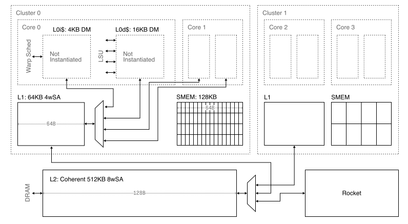
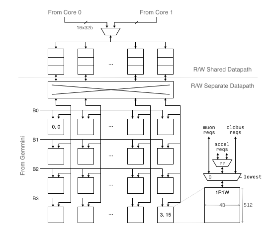
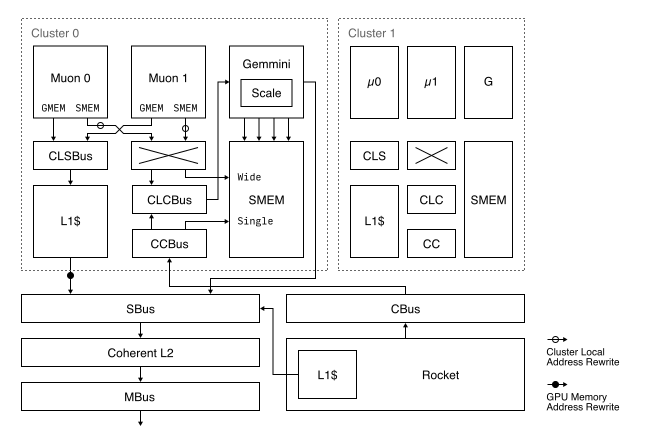

# Memory

## Cache Hierarchy

There should be a tiny L0 I$ and tiny L0 D$ per core, a larger L1 per cluster,
and L2 for the SoC. All caches are non-blocking.

### L0

#### L0i

L0i should be 4KB with 64B cache lines (8 instructions), direct mapped.

Tag array size is 64x20b.

* **Banking**: single SRAM.
* **Ports**: single port (read dominated).
* **Bandwidth**: 8B/cycle sectored read.
* **Timing**: 3 cycle read.

#### L0d

L0d should be 16KB with 64B cache lines (16 words), direct mapped, write-through.

Tag array size is 256x18b.

* **Banking**: 4 SRAMs on depth dimension.
* **Ports**: single port.
* **Bandwidth**: 64B/cycle (1 line).
* **Timing**: 3 cycle read.

### L1

L1 is a 64KiB unified cache that serves both instructions and data.

4-way set associative, write through, 64B line.

Tag array size is 1024x18b.

* **Banking**: 2 banks.
* **Ports**: single port.
* **Bandwidth**: 64B/cycle (1 line).
* **Timing**: ???

L0 and L1 will use HellaCache/NBDCache with modified MSHR datapath; write
allocate writes will not allocate and instead will be spat out.

### L2

Coherent, 512KB, 128B lines, 8-way, single port unbanked.

Bandwidth is 32B/cycle (SBus size = 256b).

## Shared Memory

In order to fulfill the [workload requirement](#flashattention-3-requirements),
Shared memory should be sized 64KB/SM, 64B lines, 1R1W dual-port per bank, banked 4x16.
Each SRAM is 4B wide, 256 entries deep.
Total aggregate bandwidth is read+write 256B/cycle.

To support intra-thread program ordering, we must treat each batch of request as
an atomized unit. That is, even in the case of serialization, there cannot be
parallel serving of different banks across requests from different cycles.

A major challenge with designing the shared memory interconnect is the existence
of bank level parallelism from Gemmini & software pipelining through tiling
across banks. This means that different banks (along the depth dimension) should
have parallel access.

Iterating upon Virgo's shared memory design, we no longer have the notion of
core *unaligned accesses*; all accesses are uniform. The main changes:

* Core serialization to create uniform requests
  * Core 0 and 1 are RR arbitrated to present a single set to SMEM
* Unaligned requests now only include off-chip slave requests
* Lowest index first now prefers core requests
  * Gemmini can experience starvation this way; however, this can be the job of
    the programmer to tile things correctly when software pipelining.
    Multi-cycle responses are already handled in the `DistributorNode`
  * Core responses this way will be guaranteed lockstep, assuming full
    pipelining

### FlashAttention-3 Requirements

FA-3's deep software pipelining chain (shown as the bold line in the diagram)
requires extensive double-buffering and concurrent producer-write-consumer-read
access.  Rather than expanding banks to achieve high memory-level parallelism,
we use 1R1W dual-ported SRAM banks.

#### Bank Mapping

In order to achieve full-throughput pipelining, we need to solve the following
list of read/write conflicts that exist in the above pipelining scheme. Because
the SRAM banks have separate read and write ports, we only need to solve
conflicts within each of read accesses and write accesses, instead of globally
across the two.

Note that `Xc` and `Xp` indicates the double-buffered consumer/producer tiles
of a given symbol `X`, respectively:

| Access  |  Tiles       | Conflict with | Reason                        |
|---------|--------------|---------------|-------------------------------|
| `READ`  | `Q`          | `Kc`          | Gemmini A/B input             |
| `READ`  | `Pc`         | `Vc`          | Gemmini A/B input             |
| `READ`  | `Q, Kc`      | `O`           | Gemmini-SIMT double-buffering |
| `READ`  | `Q, Kc`      | `QKc`         | Gemmini-SIMT double-buffering |
| `READ`  | `Vc, Pc`     | `QKc`         | Gemmini-SIMT double-buffering |
| `READ`  | `QKc`        | `O`           | Gemmini-SIMT double-buffering |
| `WRITE` | `Kp, Vp`     | `O`           | DMA-Gemmini double-buffering  |
| `WRITE` | `Kp, Vp`     | `QKp`         | DMA-Gemmini double-buffering  |
| `WRITE` | `Kp, Vp`     | `Pp`          | DMA-SIMT double-buffering     |
| `WRITE` | `O`          | `Pp`          | Gemmini-SIMT double-buffering |
| `WRITE` | `QKp`        | `Pp`          | Gemmini-SIMT double-buffering |
| `WRITE` | `QKp`        | `O`           | Gemmini-SIMT double-buffering |

Note that `O` is not double-buffered due to an intra-iteration dependency
between `O = O + P*V` GEMM and `O` rescale ops.  Every operation on `O` is done
in-place within the single tile.
`Q` is also not double-buffered, because the same `Q` tile is read multiple
times throughout the loop iteration along the entire sequence dimension of
`K^T`.

We can solve these conflicts in a mapping that requires 4 banks:

| Bank   |  Tiles           |
|--------|------------------|
| Bank 0 | `Kp, Vp, Kc, Vc` |
| Bank 1 | `QKc, QKp`       |
| Bank 2 | `O`              |
| Bank 3 | `Q, Pc, Pp`      |

#### Capacity Requirement

With the above bank mapping, the total capacity requirement for SMEM becomes:

| `Brow=Bcol` | Head dim `d` | `Q, K, V` Precision | `QK, P, O` Precision | Minimum SMEM Capacity (KiB) | Notes                          |
|-------------|--------------|---------------------|----------------------|-----------------------------|--------------------------------|
| 64          | 64           | 32                  | 32                   | 256                         | Virgo                          |
| 64          | 64           | 8                   | 16                   | 80                          | **Muon** baseline              |
| 64          | 64           | 16                  | 16                   | 128                         |                                |
| 128         | 128          | 8                   | 16                   | 320                         |                                |

Since we need some extra margin above the minimum numbers for storing row-wise
max/sum factors, etc., the current recommended size for Muon is **128KiB** with
`Brow=Bcol` 64 and head dimension 64.

**FP8 Down-conversion.**  Note that the inputs of the two GEMMs: `Q*K` and `P*V`
need to be down-converted to FP8 for consumption in the matrix PEs.

If we handle down-conversion in SIMT, it creates additional SMEM capacity
demand, since the converted FP8 values cannot be overwritten into the original
FP16 tile in-place, unless enforcing a strict ordering between the warps.
Therefore, for `Q`, `K` and `V`, down-conversion must be handled by the DMA
either in accumulator move-out, or GMEM to SMEM move-in.

However, `P` down-conversion cannot be handled by the DMA since its value is
produced in the SMEM as a result of SIMT online softmax operation. Therefore we
need to allocate separate `P8` and `P16` to handle the conversion without
mangling the data.  **TODO: Include this in the above mapping scheme.**

#### Bandwidth Requirement

SMEM bandwidth is provisioned so that it can fully saturate the SIMT compute
throughput of 16 INT32 lanes when doing element-wise operations (1 OP/byte).

### Core serialization
* add serializing coreside crossbar to create uniform requests
  * register to hold result, as well as a valid bit mask
  * 

### Shared Memory Map

| GPU Address |  Size     | Description |
|----------------|-----------|-------------------------------- |
| `0x7000_0000`  | `0x10000` | Shared memory cluster local     |
| `0x7001_0000`  |   `0x200` | Core 0 print and perf buffer    |
| `0x7001_0200`  |   `0x200` | Core 1 print and perf buffer    |
| `0x7001_3000`  |   `0x100` | Cluster local Gemmini MMIO      |
| `0x7001_3100`  |   `0x100` | Cluster local Gemmini CISC MMIO |

## Global Memory Map

|  CPU Address |  Size         | Description |
|-----------------|---------------|---------------------------------|
|   `0x4000_0000` | `0x20000`     | Cluster 0 SMEM (inc. Gemmini)   |
|   `0x4002_0000` | `0x20000`     | Cluster 1 SMEM (inc. Gemmini)   |
|   `0x6000_0000` | `0x10000`     | GPU device command processor    |
|   `0x8000_0000` | `0x8000_0000` | CPU-only DRAM (2GB)             |
| `0x1_0000_0000` | `0x8000_0000` | GPU DRAM (2GB), CPU addressable |

GPU will live in the illusion that addresses start at 0; when its requests leave
unified L1, it will be rewritten to append the 33rd bit before arriving at L2.

The Command Processor will need to have its own BootROM to act as failsafe when
the CPU fails to schedule work on the SIMT cores.

## Fabric

### Area Estimation

TODO

## Other Stuff

* Fencing support: drain LSU, invalidate L0/L1, wait for L2 coherency traffic
* Atomics: L2 only, bypassed in LSU
* Sectoring, banking in depth dim implementation

