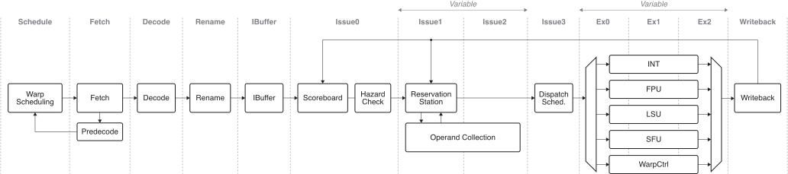

Muon SIMT Core
==============

Muon is the SIMT core of the Radiance GPU that executes shader instructions of
a Radiance device program.  Its design focuses on being stable, flexible, and
power-efficient.

## Contents

* **Design Goals**: this doc
* **Performance Target**: this doc
* **Issue Stage**: [link](issue.md)
* **Warp Scheduler**: [link](warp_sched.md)
* **Register Renaming**: [link](rename.md)

## Design Goals

### Stability and extensibility

Muon should be a stable microarchitectural implementation of the full Radiance
instruction set to facilitate prospective software development.  Where possible,
Muon should choose a simpler, over a more performant, design for better
RTL maintainability and debuggability.  It should be easy to extend Muon to
additional instruction capabilities, e.g. SIMD-shuffling and special-function
operations, to foster exploring kernel performance optimizations and hardware
co-design.

### Wide software performance latitude

Muon should perform reasonably well for a wide range of kernels.  Existing
academic architectures often exhibit high variance in performance depending on
how the kernel is written, due to e.g. stack spills and bank conflicts for
kernels with high register usage, or pipeline stalls for instructions with
back-to-back operand dependencies.  As a result, they restrict the programmer
to write kernels using rigid and inflexible optimizations, such as assembly
intrinsics and manual register allocation.  Muon should let the programmer to
both write kernels using good software practices, and also expect reasonable
performance.

### High performance-per-watt

While performance is not Muon's first priority, Muon strives to be area- and
power-efficient where possible in order to drive high perf/W.  Design effort is
focused on modules with high area consumption, e.g. issue and operand stages.
Muon should at minimum actively employ basic power optimizations such as
value-gating, and potentially explore further optimizations such as clock- or
power-gating.

## Key Microarchitecture Features

#### Dynamic warp occupancy

Muon adaptively sets the number of warps in multithreaded execution depending
on the kernel's register usage.  If the kernel uses a small number of
registers, Muon schedules many warps to increase the opportunity of hiding long
pipeline stalls with multithreading; if the kernel's register usage is high, it
scales down concurrent warps to prevent running out of the physical register
space.

This gives the programmer a useful lever to trade-off thread-level parallelism
for more register space in the kernel.  While high TLP helps with
latency-hiding, more register space lets each thread to participate in many
concurrent operations, which also enables latency-hiding capabilities with
instruction-level
[parallelism](https://www.nvidia.com/content/gtc-2010/pdfs/2238_gtc2010.pdf).
An example is the GEMM kernel with large per-thread tile sizes and aggressive
loop-unrolling.

Dynamic warp occupancy is also necessary requirement from Muon's ISA, which
dramatically expands the number of architectural registers from RISC-V's 32 to
256.  Without virtualizing the architectural registers, it is challenging to
fit them into the physical space.

* Operand-forwarding paths

TODO.

* Hardware threadblock scheduler

TODO.

* Efficient operand collector

TODO.

## Performance Target

We first discuss a number of *hyperparameters* for Muon from which we derive
other microarchitectural design parameters.

### Capacity

| Parameter                        | Target Value | Unit             | Notes |
| -------------------------------- | ------------ | ---------------- | ----- |
| Arch. warp width `VLEN`          | 16           | threads/warp     |       |
| uArch. warp width `DLEN`	       | 16           | bits             |       |
| Warp slots per core	             | 8            | warps            |       |
| Arch. word size	                 | 32           | bits             |       |
| Arch. register file size (max)   | 128          | regs/thread/warp | ISA supports 256; compiler currently limits to 128 |
| Arch. register file size (min)   | 32           | regs/thread/warp | Determines # of warp slots in the hardware  |
| Physical register file size	     | 16384        | bytes            |       |

### Bandwidth

| Parameter                        | Target Value | Unit              | Notes |
| -------------------------------- | ------------ | ----------------- | ----- |
| Max IPC                          | 1            | warp-inst/cycle   | Single-wide issue per warp; Wide issue across warps is possible |
| INT32 SIMT FLOPS                 | 1            | FLOP/thread/cycle | 16 INT PEs for 16-wide warps. |
| FP32 SIMT FLOPS                  | 0.5          | FLOP/thread/cycle | 8 FP32 PEs for 16-wide warps. |
| FP16 SIMT FLOPS                  | 1            | FLOP/thread/cycle | Assumes 2x bit-scaling from FP32 |
| Register operands                | 4            | regs/inst         | rs1/rs2/rs3/rs4 |
| RF Read Bandwidth Requirement    | 256          | bytes/cycle       | Minimum RF BW needed for no conflict, 4 operands |
| L1 Bandwidth                     | 64           | bytes/cycle       | Provisioned for single-word access per thread |
| L2 Bandwidth                     | 32           | bytes/cycle       | Requires 2x reuse at L1 |

### Latency

| Parameter                        | Target Value | Unit              | Notes |
| -------------------------------- | ------------ | ----------------- | ----- |
| L1 Hit Latency                   | 8            | cycles            | TODO: Arbitrary. Commercial: 16-32 cycles. |
| L2 Hit Latency                   | 20           | cycles            | TODO: Arbitrary. Commercial: ~100 cycles. |
| DRAM Latency                     | 100          | cycles            | TODO: Arbitrary. Commercial: >400 cycles @1GHz, see reference |

Reference: [link](https://jsmemtest.chipsandcheese.com/latencydata)

## Pipeline Architecture

TODO populate.
Descriptions of each pipeline stage:

* **Instruction buffer**: Decouples the core front-end from the back-end.
  * Back-end hiccups (e.g. RF bank conflicts, FU port conflicts) should not
    stall the front-end and underutilize the available fetch bandwdith.  In OoO
    CPUs, this is mitigated by deep issue queue / reservation stations
    decoupling FE from BE. However, IQ/RS is expensive due to its CAM
    structure, and moreso with wide SIMT operand bits.  Instead, we put a
    separate instruction buffer before the RS to achieve high elasticity
    without enlarging issue window size and incurring HW cost.
