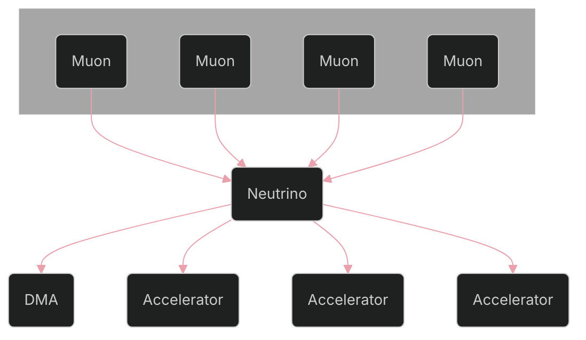

## Synopsis

**Neutrino** is a companion core that lives alongside the Muon SIMT cores in every cluster. It is a scalar core running regular rv64g ISA, handling the following tasks for the GPU:


* **Synchronization**, across a combination of SIMT cores, resident accelerators, and the memory system;
* **Accelerator dispatch**, offloading accelerator commands off SIMT and setting up necessary software contexts for the accelerators;
* **Load balancing**, in the form of redirecting work, as well as signaling priority to the memory system;
* **Dependency management**, allowing accelerator chaining with asynchronous invocation (fire and forget) with minimal latency;
* **Data orchestration**, feeding processing elements in both SIMT and accelerators with operands that follow a regular memory pattern.

It is programmed alongside the SIMT core in the form of a separate binary designated solely for Neutrino, delivered as an additional payload in the SIMT kernel. The Neutrino binary need not be, and should not be using the same ISA as the SIMT cores.

Neutrino is the natural next step after memory decoupling in Virgo; it goes to the extreme for **control decoupling**, prevent the SIMT cores from wasting cycles and hardware state resources invoking non-SIMT blocks.
## Microarchitecture
Neutrino itself is a scalar 64-bit RISC-V core; depending on throughput requirements it may have varying pipeline stages, and may be superscalar. It should implement `rv64g_zicsr`, optionally supporting half precision floats.
### Memory System
The memory system for Neutrino should largely be disconnected from the general GPU memory system. This allows Neutrino's narrow, scalar accesses to be decoupled from the wide, parallel accesses initiated by the SIMT pipelines; this serves two purposes: it reduces the hardware design complexity by introducing a differently-sized client, and it also reduces performance perturbation to GMEM.

Neutrino should have a small data cache that is not connected to Muon's L1 or L2; instead, it should be directly connected to DRAM, or optionally have a private LLC shared across clusters. A separate NoC should connect all Neutrinos in the case of multiple clusters.
Neutrino should either not have DRAM-backed instruction memory (i.e. scratchpad, good early option), or have a I-Cache that shares the D-Cache data-path going outwards.

> There could be an argument to be made to allow additional TileLink edges into SMEM and GMEM, if it aids dispatch. However, the bulk of the data should really be already stored in SMEM or retrieved from GMEM by DMA; configuration should be done in instructions. The SMEM argument only stands for MMIO.
### Interface with Cluster Components
#### Accelerators
Neutrino should support **standard RoCC instructions**, allowing minimal modifications to existing RoCC accelerators' software stacks. It should however assign numerical identifiers to each connected accelerator, so that the RoCC instructions can be addressed to a particular target by SIMT.

For ease-of-use, it may be a good idea to hardcode core components to certain IDs. Examples: DMA, barrier synchronization target, memory load/store (more later).

There should also be an option for memory-mapped instruction issue, in the case when the accelerator IP might not support RoCC; in which case, either a RoCC shim or an MMIO shim should be used.

**===TBD===** how to track completion? could require a done signal from accelerator, or wait for not busy
#### Muons
On the Muon->Neutrino direction, instruction/rs1/rs2 is passed. This should go through an intermediate argument buffer that holds arguments until the invoke command is issued. For multiple Muons, the last writer shall win.

On the Neutrino->Muon direction, a stall signal can be asserted to force the SIMT core to schedule a new warp.

To support different participation modes (later), a bitmask barrier module is used bookkeep SIMT issues. This is one of the two ways to force synchronization, the other being accelerator dependent synchronous invocation.
### Hardware Dependency Management Module
Neutrino should have the means to track complicated dependencies across different components in the system. This requirement manifests as a **task scoreboard**, keeping track of each task's dependent tasks, and issue out tasks as dependencies are resolved.

The scoreboards should also hold a pointer to the location at which the task arguments are stored. At task issuance, an interrupt should be raised with the pointer to the arguments. As a result, there needs to be an interrupt connection between the scoreboard and the core.
### Load Balancer
Accelerator blocks that access the shared memory, as well as DMA transactions that involve the shared memory will require a Quality of Service (QoS) field. The shared memory interconnect will be upgraded with weighted round robin to select the client based on QoS requirements. Neutrino should support propagating the QoS through its subservient blocks into the memory system.
This must also be supported by the software stack, which may be a statically assigned priority value that is empirically determined initially; future work may include a scheduler that automatically handles workload latency matching.
### DMA
The DMA should support regular access patterns to GMEM, SMEM, and other potential clients/managers. There may be instances of the DMA stamped out to support concurrent operations.
#### Address Generation
There should be two address generators, for loads and stores. The generator should have a configurable number of maximum dimensions; each dimension should be specified the *stride* and the *length*. There should be a globally statically configured word size, representing the smallest granularity.

As the pattern is generated, it needs to be reshaped so that the lowest dimension has the same width as the request/response bus; this is either done by *folding* dimensions or *expanding* dimensions. A dedicated module should be designed to perform this operation, either with or without actual data (i.e. could just be generating masks).

It is trivial to expand the last dimension, however it might not be realistic to require all dimensions to be foldable if they all happen to be small - the hardware circuit may be expensive and have low utilization. A configuration parameter should be used to configure this (e.g. only fold last 2 dimensions).
#### Data Movement
At elaboration time, a list of sources (can only Get) and a list of destinations (can only Put) should be provided. Note that both sources and destinations should be TileLink Managers. Requests sent should be demuxed to the configured source, tagged with the QoS class; a configurable number of buffer entries sit in between the response data and the request channel on the destination; there will only be once such buffer instance since there is a single concurrent transaction per DMA.

At the buffer, the enqueued data must be *packed*. This is the means to convert between pattern specifications when the lowest (folded) dimension is not full. A packing circuit muxes all required data into the queue, and an unpacking circuit demuxes them into appropriate lanes on the dequeue side.

Within a DMA instance, bookkeeping is required to maintain a large number of in flight requests if the response is not guaranteed to be FIFO. Across all DMAs, requests for a common manager (either Get or Put) needs to be arbitrated with the QoS weights.
> There could also be extensions to the "waist" of the DMA pipeline to reformat data, e.g. quantization or streaming normalization.
## Programming Model
As previously mentioned, Neutrino will receive a separate sequence of instructions than the Muon cores, and they will not be binary-compatible. The programming model will orbit around making this paradigm maximally user-friendly and easily implementable.

This separate sequence of instructions are a list of **task handlers**, each behaving like a function, and is assigned an identifier automatically. When Muon wishes to invoke a task, the identifier will be used to select the desired routine for Neutrino to execute.
### ISA Extension
Since Neutrino needs to maintain compatibility with standard RISC-V software stacks, there will be little ISA modifications. However, to invoke Neutrino, the Muon ISA will require additional custom instructions.

The driving principle of the ISA extension design is to minimize perturbations to SIMT execution, while being as expressive as possible. To this end, there will be three types of instructions:
#### Payload Instruction
Payload instructions will encode arguments that are passed to a task handler. There can be zero payload instructions, or there could be multiple. The arguments to a task are serialized into a packed struct, and they are sent as register contents, 2 registers at a time.

* Instruction: `[ f7 = sequence no. | rs2 | rs1 | f3 | rd = x0 | op ]`
* rs1: `[ packed payload ]`
* rs2: `[ packed payload ]`
* rd is not used.
#### Invocation Instruction
Invocation instructions will kickoff a task. It encodes what task to run, who participates in this task, what other tasks this one depends on, and whether to stall waiting for the issue to complete. Only a single invocation instruction is required per kickoff; it must entail all payload instructions.

* There are 4 metadata fields.
	* *synchronicity* indicates whether to wait for the task to be scheduled;
	* *participation mode* indicates how many SIMT elements should arrive before the task can be kicked off, options include thread/warp/core/cluster;
	* *dummy target* indicates that there is no actual function to execute, but Neutrino should synchronize regardless;
	* *retire mode* indicates how the task is marked as complete and thus retired from the scoreboard: options include immediate/signal/manual.
* Instruction `[ imm = (qos | retire | sync | part | dummy) | rs1 | f3 | rd | op ]`
* rd returns the scheduled *run* ID, an invoked execution instance of a task. 
* rs1: `[ dep2 | dep1 | dep0 | task id ]`, where `dep*` are either other run IDs this run depends on, or `0` to indicate no dependency.
* rs2 is not used. 
#### Completion Instruction
Completion instructions are similar to invocation instructions, but instead of kicking off a task it retires one. If the task to be completed has not yet been issued out, it will be marked as to be retired immediately upon issuance.

* Instruction `[ imm = part | rs1 | f3 | rd | op ]`
* rs2: `[ unused | run id ]
* rs1, and rd are not used.

In reality, this instruction can most likely be merged with the invocation instruction and processed together, with `f3` to differentiate the two.
#### ISA In Practice
By using these two instructions in different ways, we can achieve different desired effects without resorting to dedicated hardware modules. Here I list a couple examples:

**Barriers** can be achieved by using *synchronous* invocation instructions that has a *dummy target*, with *immediate completion*. The synchronization granularity can be selected by configuring *participation mode*.

**Memory fences** can be achieved by using *synchronous* invocation instructions that has *dependencies* set to preconfigured targets (provided there are fake run IDs for memory loads and memory stores).

**Gemmini matmul** can be asynchronously invoked by using *asynchronous* invocation with *single thread* participation, and *task ID* set to the matrix multiplication routine in `gemmini.h`. The operands, e.g. size & addresses, can be send with payload instructions. Completion mode should be marked as *signal*.

**Producer-consumer** relationships can be encoded with two invocations with *dummy targets*, from two SIMT elements. The producer should *asynchronously invoke* with *manual completion* first to allocate the run ID. The consumer should *synchronously invoke* with *immediate completion*, dependent on the producer's run ID - this stalls the consumer until the producer is done - at which point the producer issues a *completion* instruction, releasing the consumer's stall.
**Software poll spin** can be achieved with a poll routine in software, and *synchronous* invocation.
### Dependency Tracking
As covered in the ISA commands, each invocation will produce a **run ID**, the identifier of a particular round of execution for a task. If the same task is repeatedly invoked, it will generate a different run ID each time. The run ID is 8 bits, meaning there can be 256 simultaneous runs.

Although invocations might not be done by all threads (dependent on participation), all threads that encounters this instruction at all should receive the same run ID. ==TODO==: mechanism for this.

When a run depends on another run, it will not be issued until all dependencies are met. There exists an edge case: if the prerequisite run does not exist, it should be treated as if there is no dependency. This is because if the prerequisite run finishes and retires before the dependent run is invoked, there could be a deadlock.
### Software Stack
The SIMT program would resemble this:
Generated kernel header:
```c
typedef uint8_t run_id_t;
typedef uint8_t task_id_t;
task_id_t matmul_task = 1;
typedef struct { void *addr_a; void *addr_b; } matmul_args_t;
```
GPU kernel (suppose there's a pipeline preprocess -> matmul -> postprocess):
```c

run_t preprocess_done;
run_t matmul_done;

if (warp_should_preprocess) {
	while (still_have_stuff) {
		preproc_done = neutrino_invoke(0, NO_DEPS, ASYNC | CLUSTER | MANUAL);
		do_preprocess_stuff();
		// notify consumer
		neutrino_complete(preproc_done, PREPROCESS_WARPS);
		
		// kick off matmul asynchronously
		neutrino_payload((matmul_args_t) {addr_a, addr_b});
		matmul_done = neutrino_invoke(matmul_task, DEPS(preproc_done), ASYNC | SINGLE_THREAD | SIGNAL);
	}
} else if (warp_should_postprocess) {
	while (still_have_stuff) {
		// wait for matmul stage done
		neutrino_invoke(0, DEPS(matmul_done), SYNC | SOME_WARPS | IMMEDIATE);
		do_postprocess_stuff();
	}
}

int stage0;
int stage1;
int stage2;

if (preproc) {
	while (i) {
		sync();
		invoke(stage0(i));
		i++;
	}
} else {
	while (i) {
		sync();
		wait(stage0(i));
		i++;
	}
}

function barrier(warps) {
	neutrino_invoke(0, NO_DEPS, SYNC | warps | IMMEDIATE);
}

while (more_to_process) {
	neutrino_payload((matmul_args_t) {addr_a, addr_b});
	matmul_done = neutrino_invoke(matmul_task, NO_DEPS, ASYNC | SINGLE_THREAD | SIGNAL);

	softmax_done = neutrino_invoke(0, DEPS(prev_matmul_done), SYNC | ALL_WARPS | DUMMY | MANUAL);
	do_softmax();
	neutrino_complete(softmax_done, ALL_WARPS);

	prev_matmul_done = matmul_done;
}

// synchronize the whole cluster
neutrino_invoke(0, NO_DEPS, SYNC | CLUSTER | DUMMY | IMMEDIATE);
do_gpu_stuff();
```
In reality this is also way too verbose. There is probably a good way of generating all this boilerplate - good target for 265 project?

Neutrino's source:
```c
void matmul_task(void *addr_a, void* addr_b) {
	do_matmul();
	maybe_complete_the_matmul_run();
}
```
The Neutrino binary compiler, which runs first, should:
* Assign `matmul_task` a task ID;
* Identify the function arguments and make a struct;
* Generate a header file for SIMT so that it could reference both the task ID and the task argument struct;
* Attach boilerplate such as the interrupt handler;
* Generate a binary with the task functions.

The Muon compiler should:
* Automatically include the generated Neutrino header file;
* Assemble the invoke and complete instructions into single lines;
* Expand the payload calls into multiple instructions, as required by the payload size;
* Copy the Neutrino binary into a special section;
* Include ROM code that delivers the Neutrino binary.
### Task Invocation Procedure
When a task is successfully scheduled, an interrupt is sent to Neutrino, and the task arguments are moved onto the CPU stack by the interrupt handler. Once the stack frame is set-up, the interrupt handler delegates control back to the task function by jumping to a static address corresponding to the task ID.

When a task function exits, the stack frame should be torn down, along with clearing the heap. Interrupts are then re-enabled and the task queue is notified.
### Core Memory Management
Neutrino during execution should only use its own private memory region (stack, heap), but it could refer to the entire GMEM address space. The private memory region should be mapped onto a GMEM reserved address space.

The heap should be managed by overriding the default `malloc` implementation, and instead use physical memory, `sbrk`, and a simple memory allocation mechanism.
### Scheduling, Load Balancing
This might warrant further studies in a future software scheduler, which could be especially beneficial coupled with a higher level pipeline representation, as opposed to low level assembly-like task programming.
## Methodology
==TODO==: cosimulation
## Power
==TODO==: dynamic, implicit power gating
## Compiler
==TODO==: compile higher level pipeline representation
