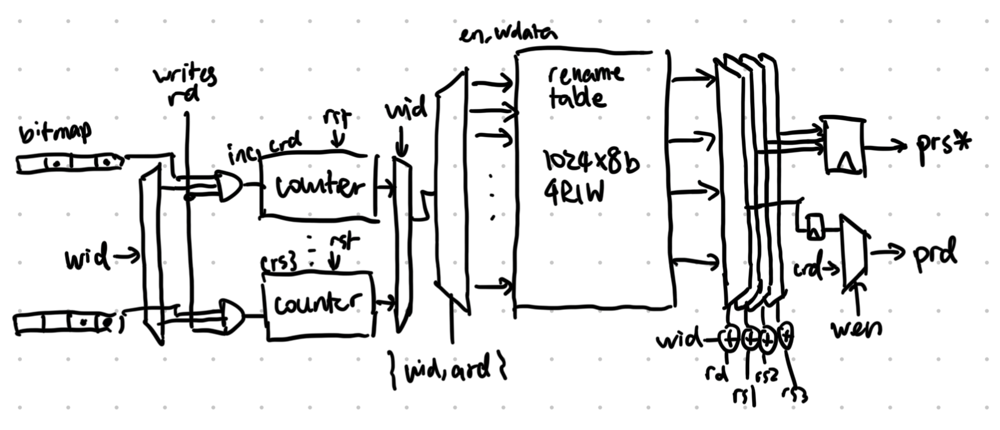

# Rename

## Overview

The rename stage takes an architectural register (AR) name per cycle and
assigns physical register (PR) name to it. The block assumes that per-warp AR
usage will never exceed the limit specified by the command processor, so it
does not maintain a free list.

The rename stage also takes the source ARs, which should already be mapped, and
translate them into physical registers. This done by reading the map table.

The block is instantiated per core, and takes care of all threads of all warps
in that core. It is **in parallel with Decode** and makes **IBuffer store PRs**.
As a result, it takes one instruction per clock.

## Parameters

* Number of total PR (names): tentatively max 32 regs @ 8w: 256 PRs
* Max number of warps: 8

## Top Level IO

From I$ & parallel decode:
* Input valid: was there a fetch from I$?
* Write valid: derived from whether the instruction writes to RD (decode)
* ARD, ARS1, ARS2, ARS3
* Warp ID
* (Log) Regs per warp: set by the command processor
* Reset assignments: Unbinds all ARs seen

To IBuffer:
* Renamed instruction
* Warp ID

**Q: IBuffer: stores decoded bundle (uops)?**

## Operation

Upon reset, the block initializes the map to all point to phyiscal register 0,
all warp usage counters to 0. Bitmaps set to false. The map needs to be 4R1W,
`log(PRs)` bits wide, and as deep as the total number of PRs.

Bitmap register is separate to accelerate valid checking before counter
increment, instead of adding a valid bit to an array entry.

This array should either be a flop array or two 2R1W SRAMs.

### Stage 0:

When a register rename request comes in, the bitmap register for that warp is
checked to see if the incoming AR has already been assigned. The inverse of
this is fed to the enable of the warp usage counter, incrementing it when a new
assignment is made. The bitmap register is updated.

In parallel, the array is being read, using the concatenation of `wid` and `rd`
through `rs3`. The result is flopped.

AR0 is a special case and will always map to PR0. Short circuit the request.

### Stage 1:

Array read result is available after flopping a cycle; counter + 1 is flopped.
Based on whether a new AR was allocated in stage 0, output one of these two and
concatenate with other bits of the instruction (demux'd) into the correct
IBuffer.

**Q: If IBuffer is empty, have flow=true?**

In parallel, if a new AR was allocated, initiate a write to the array to store
the new assignment. If a new request arrived to ask for the same AR in any
register, bypass the array read and forward the new assignment next cycle. Need
to take care this happens 1 time max.

## Future Improvements

### Compiler Static Renaming

We should not need to do this mapping based on a table if the compiler can
assign sequential register names. This will greatly reduce the total table size
and eliminate the need for SRAMs.

### Multiple Renames per Cycle

If we want to support dual fetch & decode per warp (unlikely), this is
requried.

