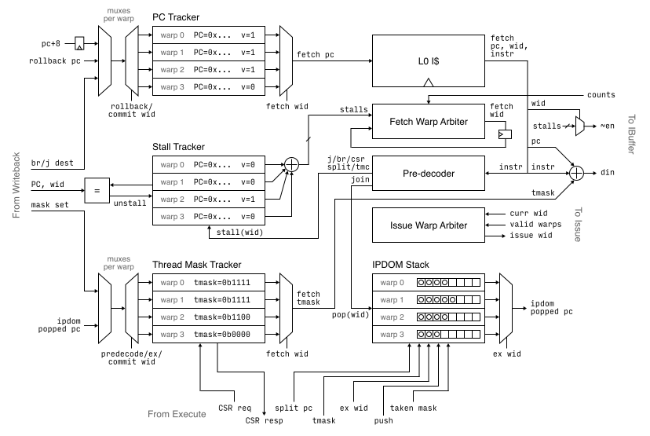
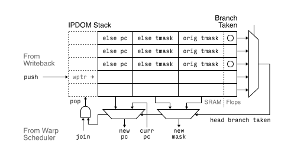

# Warp Scheduler

## Overview

The warp scheduler needs to handle the control flows of each of the warps, and
schedule the right warp at the right time to the rest of the core.

The block keeps track of all PCs, increments the PC of the active warp during
execution, and handles branches, jumps and splits. An IPDOM stack subblock
takes care of nesting conditionals. A predecoder preemptively stops new fetches
from reaching IBuffers after a control flow change.

There are two arbiters: one for which warp to fetch, one for which to issue.

This block is instantiated per core.

## Parameters

* Max number of warps: 8
* IPDOM stack size: 8

## Top Level IO

> From command processor:
> * Spawn PC & spawn valid: one warp at a time (?)

From Writeback:
* Branch/jump resolved destinations & valid
* Commit PC
* Mask set value, operation & valid
* IPDOM stack push, PC in, taken mask
* Warp ID
* Warp spawn valid, PC, count

To I$:
* PC to fetch

From I$:
* Fetched instruction
* Metadata
  * PC
  * Thread mask

To Rename/Decode:
* Fetched instruction (straight from I$)
* Warp ID that was fetched
* PC, thread mask

From IBuffer
* Count (for arbitration)

<!--
From Reservation Station:
* Bitmap of valid warps to issue
* Current warp ID
-->

From/To Execute:
* Current warp mask for CSR
<!-- * Thread mask/warp mask CSR read request & response -->

<!--
To Issue:
* Warp ID to be issued
-->

## Operation

<!--
### Stages

* Stage 0: fetch warp selection, PC mux
* Stage 1: I$ read, output to IBuf, predecode; PC+8 updated
* Stage 2: updated stall tracker

Upon control flow resolution

* Stage 0: Execute informs of next PC, mask; unstall
* Stage 1: stall tracker updated, PC/mask updated, eligible for PC mux
* Stage 2: potential next instruction fetched

Upon join: 2 cycle stall

* Stage 0: predecode the join instruction, temp stall warp
* Stage 1: stalled, IPDOM popped/updated, next mask/PC determined, unstall
* Stage 2: unstalled, PC/mask updated, eligible for PC mux
* Stage 3: next instruction fetched
-->

### Fetch warp selection

Each warp can stall due to a pending control flow instruction; all
non-stalled warps are fair game for selection. The policy is as follows:

* If the currently fetched warp is not stalled AND is not about to be
  stalled (currently predecoded instruction is not a control flow
  instruction), keep fetching it.
* Otherwise, fetch the warp that has the lowest number of entries in its
  IBuffer.
  * Hopefully this is cheap, if number of entries is low.

By default, all warps are stalled.

<!--
### Issue warp selection

The Reservation Station will inform the warp scheduler of all warps currently
eligible to be issued. This means the warp is not starved and is free of
hazards. It will also output the current warp ID (last issued).

The warp scheduler will try to select the current warp, if it's valid.
Otherwise, a round robin arbiter will pick the next warp.
-->

### Control flow changes

Any of the jumps (jal/jalr), branches, splits (but not joins), thread mask
changes (tmc, pred) will stall the warp until that instruction is committed.

The predecoder will look for these opcodes and mark the warp as stalled in the
stall tracker. The stall tracker is a per-warp record that notes the PC of the
stalling instruction. A line from instruction Writeback will notify the stall
tracker of the PC being retired (along with the warp ID); if there's a match,
the stall is lifted, and the warp becomes eligible for fetch again. The priority
mux select will likely lead to this (starved) warp be immediately fetched.
During a stall, the PC will not be incremented.

#### IPDOM stack

Conditionals are handled with the split and join instructions. An IPDOM stack
keeps track of the PCs at all levels in nested conditional clauses. The Execute
stage is responsible of producing a *push* signal for the IPDOM stack, but the
predecoder is responsible of producing the *pop* upon join. In a typical
if/else setup, Execute informs the scheduler of which threads are taking the
  branch. At this time, a new entry consisting of four items are pushed onto
  the stack:

* mask of the not-taken threads, calculated by `tmask ^ taken_mask`
* PC of the split instruction + 8 (start of else branch)
* mask of all currently active threads (after else branch)
* whether not-taken is already executed: by default false, unless non-divergent

Upon predecoding a join, the stack is popped or updated. 

The stack itself is implemented with a 1R1W SRAM; however, we have a separate
flop array that indicates whether each entry's then clause is already taken.
This is because the pop operation requires a same cycle read/write to the head
of the stack to its taken status. Furthermore, upon joining the end of the then
clause and prior to the start of the else clause, the entry itself (the PCs and
masks) are not updated.

### I-Cache pipelining & stalls

The warp scheduler will keep running ahead for PC increments and requesing I$.
The I$, being non-blocking, will pipeline internally. Assuming without misses,
we assume full throughput every cycle, as well as a small and relatively fixed
latency. I$ misses can stall the pipeline (relies on internal pipelines to hide
that miss).

The pre-decoder will be the source of information for cutting the flow from I$
to IBuffer. It is the job the warp scheduler to prevent any hazardous
instructions from entering the IBuffer. The predecoder processes all
instructions, and when the stalling information is available the next cycle, we
combinationally cut off the next (hazardous) instruction from entering Rename.

We keep track of a table that is separate from but similar to the stall tracker,
called the discard tracker. This table keeps track of whether each warp is in
*discard mode*, which indicates that a current stall is causing earlier fetched
instructions of the warp from entering Rename. It also keeps track of at which
PC the discard mode can be disabled. Since I$ response carries the request PC,
we know what each response corresponds to; in addition, since PC is fetched in
sequence in a montonically increasing way, we know that the response PC can be
a unique identifier of progress.

#### Discard mode interaction with stalls

Discard mode will start as a result of a stalling instruction. However, no new
hazards will occur during discard mode - which means it's not possible to nest
discards. This is the case since all instructions during discard mode will be
dropped and nothing will be predecoded.

It is though possible to have stalls resolved before the response that is
supposed to lift discard mode arrives. In this situation, it's possible for a
warp to be not stalled but in discard mode. The warp scheduler will keep issuing
I$ requests for the subsequent (legal) PCs after the stall. Eventually, discard
mode will be lifted and I$ responses will start to be processed again. We know
that no legal instruction would have been dropped, since I$ response is FIFO in
respect to I$ request, and that the legal fetches after stall resolution will
only follow the discard lifting response.

#### Credited interface

The I$ response interface is valid-only. We do not want to overwhelm the IBuffer
and cause any instructions to be dropped, since that impacts the correctness of
the program. To remedy this, we keep a per-warp I$ in-flight request count.
Combined with the per-warp IBuffer occupancy count, we know how many
instructions are either already in the warp's IBuffer or will be soon.

When we hit the limit for IBuffer, that particular warp will be stalled, but
using a dedicated mechanism different from the stalls that are induced by
control hazards. When the warp scheduler checks whether a warp is stalled, it
looks at both *reason*s, but instructions can only toggle the control hazard
reason bit, and the in-flight counter + occupancy can only toggle the IBuffer
reason bit.

### Branch/jump/mask resolution

The Writeback stage gives the branch/jump destinations, as well as updated
thread mask. See Stages section for operation.

Upon thread mask set to 0, the warp is not unstalled (keep stalled).

### Warp spawning

When the command processor asks for a new warp to be spawned, the PC of that
warp is set to the given PC, the stall tracker is updated to unstall that warp,
and the thread mask value is set to all 1s. All of these are done at the same
time so the state is synchronized when being scheduled.

TODO: do we need to stall CSRs as well?

## SRAM Physical Dimensions

IPDOM stack: max warps * depth * (pc width + tmask width * 2) = 512B
(64x64b) 1R1W
Mask/PC state: max warps * (pc width + tmask width) = peanuts
Stall tracker, discard tracker: max warps * (pc width + 1) = peanuts

## Future Improvements
