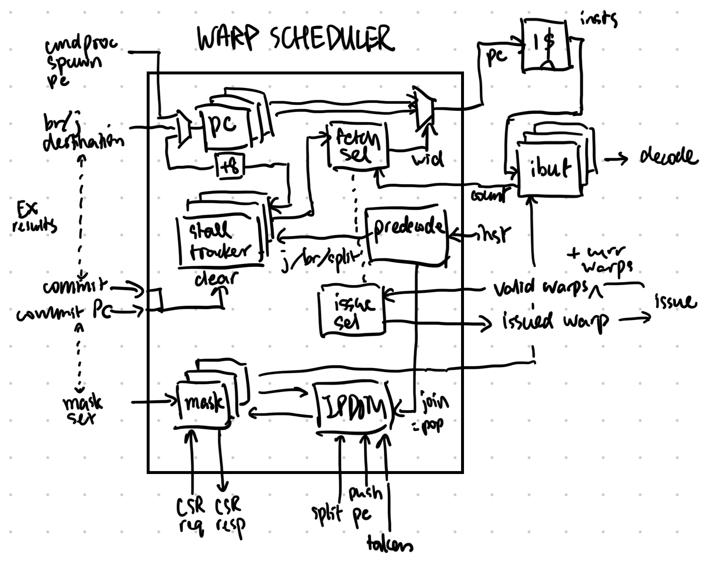

# Warp Scheduler

## Overview

The warp scheduler needs to handle the control flows of each of the warps, and
schedule the right warp at the right time to the rest of the core.

The block keeps track of all PCs, increments the PC of the active warp during
execution, and handles branches, jumps and splits. An IPDOM stack subblock
takes care of nesting conditionals. A predecoder preemptively stops new fetches
from reaching IBuffers after a control flow change.

There are two arbiters: one for which warp to fetch, one for which to issue.

This block is instantiated per core.

## Parameters

* Max number of warps
* IPDOM stack size

## Top Level IO

From command processor:
* Spawn PC & spawn valid: one warp at a time (?)

From Writeback/Commit:
* Branch/jump resolved destinations & valid
* Commit PC
* Mask set value, operation & valid
* IPDOM stack push, PC in, taken mask
* Warp ID

To I$:
* PC to fetch

From I$:
* Fetched instruction

To IBuffer/Decode:
* Fetched instruction (straight from I$)
* Warp ID that was fetched
* Corresponding thread mask

From IBuffer
* Ready: IBuffer not full
  * Potentially: high water level signal before full
* Count (for arbitration)

From Reservation Station:
* Bitmap of valid warps to issue
* Current warp ID

From/To Execute:
* Thread mask/warp mask CSR read request & response

To Issue:
* Warp ID to be issued

## Operation

### Stages

* Stage 0: fetch warp selection, PC mux
* Stage 1: I$ read, output to IBuf, predecode; PC+8 updated
* Stage 2: updated stall tracker

Upon control flow resolution

* Stage 0: Execute informs of next PC, mask; unstall
* Stage 1: stall tracker updated, PC/mask updated, eligible for PC mux
* Stage 2: potential next instruction fetched

Upon join: 2 cycle stall

* Stage 0: predecode the join instruction, temp stall warp
* Stage 1: stalled, IPDOM popped/updated, next mask/PC determined, unstall
* Stage 2: unstalled, PC/mask updated, eligible for PC mux
* Stage 3: next instruction fetched

### Fetch warp selection

Each warp can stall due to a pending control flow instruction; all
non-stalled warps are fair game for selection. The policy is as follows:

* If the currently fetched warp is not stalled AND is not about to be
  stalled (currently predecoded instruction is not a control flow
  instruction), keep fetching it.
* Otherwise, fetch the warp that has the lowest number of entries in its
  IBuffer.
  * Hopefully this is cheap, if number of entries is low.

By default, all warps are stalled.

### Issue warp selection

The Reservation Station will inform the warp scheduler of all warps currently
eligible to be issued. This means the warp is not starved and is free of
hazards. It will also output the current warp ID (last issued).

The warp scheduler will try to select the current warp, if it's valid.
Otherwise, a round robin arbiter will pick the next warp.

### Control flow changes

Any of the jumps (jal/jalr), branches, splits (but not joins), thread mask
changes (tmc, pred) will stall the warp until that instruction is committed.

The predecoder will look for these opcodes, combinationally kill the
instruction heading to IBuf, and mark the instruction as stalled in the stall
tracker. The stall tracker is a per-warp record that notes the PC of the
stalling instruction. A line from instruction Writeback will notify the stall
tracker of the PC being retired (along with the warp ID); if there's a match,
the stall is lifted, and the warp becomes eligible for fetch again. The
priority mux select will likely lead to this (starved) warp be immediately
fetched. During a stall, the PC will not be incremented.

Conditionals are handled with the split and join instructions. An IPDOM stack
keeps track of the PCs at all levels in nested conditional clauses. The Execute
stage is responsible of producing a *push* signal for the IPDOM stack, but the
predecoder is responsible of producing the *pop* upon join. In a typical
if/else setup, Execute informs the scheduler of which threads are taking the
  branch. At this time, a new entry consisting of four items are pushed onto
  the stack:

* mask of the not-taken threads, calculated by `tmask ^ taken_mask`
* PC of the split instruction + 8 (start of else branch)
* mask of all currently active threads (after else branch)
* whether not-taken is already executed: by default false, unless non-divergent

Upon predecoding a join, the stack is popped or updated; see Stages section.

### Branch/jump/mask resolution

The Writeback stage gives the branch/jump destinations, as well as updated
thread mask. See Stages section for operation.

Upon thread mask set to 0, the warp is not unstalled (keep stalled).

### Warp spawning

When the command processor asks for a new warp to be spawned, the PC of that
warp is set to the given PC, the stall tracker is updated to unstall that warp,
and the thread mask value is set to all 1s. All of these are done at the same
time so the state is synchronized when being scheduled.

TODO: do we need to stall CSRs as well?

## Future Improvements
